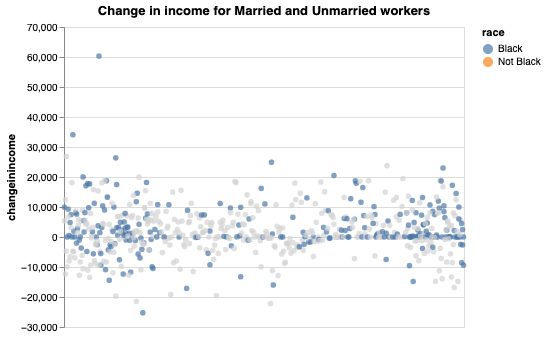
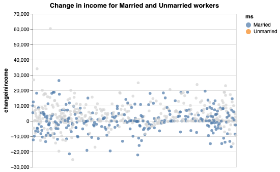
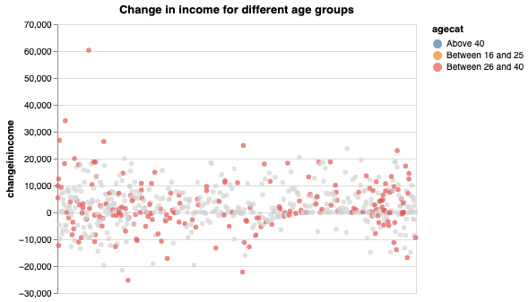

### Multiple Regression Analysis on the subset of data used in National Support Work (paper) by economist Robert Lalonde.

### The idea behind this study was to find the impact of job training on annual earnings of NSW workers during 1970s.

### Final Regression Model: y = β0  + β1 . treat(0) + β2 . age + β3 . married(0) + β4 . treat(0) : age

  
